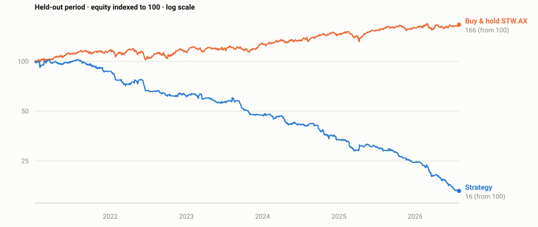

# ASX Mean-Reversion Analyser

[](https://github.com/alexanderramsay278/asx-analyser/actions/workflows/tests.yml)

A Python tool that screens ASX-listed equities for mean-reversion swing setups, returns a `BUY / WAIT / AVOID` signal with stop, target and risk-based sizing, and — because the strategy was backtested — tells you when your account is too small for the signal to be worth trading.

Built independently as a first-year Commerce and Economics student.

**The headline result is negative, and it is stated up front on purpose:** across 2,160 backtested trades the signal carries a real edge of **+0.25% per trade**, and ASX retail transaction costs are roughly three times larger than that edge. The strategy is capital-gated, not idea-gated.

---

## Install and run

```bash
git clone https://github.com/alexanderramsay278/asx-analyser.git
cd asx-analyser
python -m venv .venv
source .venv/bin/activate        # Windows: .venv\Scripts\activate
pip install -r requirements.txt
```

```bash
python asx_analyser.py CBA
python asx_analyser.py CBA BHP NAB --portfolio 50000
python report.py CPU XRO --portfolio 20000   # writes a standalone HTML report
python -m pytest test_strategy.py -v
python backtest.py               # reproduces every figure below;
                                 # writes backtest_trades.csv
```

`report.py` writes a self-contained HTML file — inline CSS, no scripts, no external requests, light and dark — from the same signals the terminal produces.

The optional `--commentary` flag adds qualitative context from the Anthropic API and requires `ANTHROPIC_API_KEY`. **It cannot change the signal, the levels, or the sizing.** Everything else runs offline apart from Yahoo Finance price data.

---

## Architecture

```
strategy.py        indicators + signal rules. Deterministic. No model calls.
  ├── asx_analyser.py    live screen (terminal); optional LLM commentary layer
  ├── report.py          same signals rendered to a standalone HTML file
  ├── backtest.py        portfolio simulation over historical data
  └── test_strategy.py   15 tests, including a no-lookahead property test
```

`strategy.py` is the single source of truth. The analyser and the backtest import from it rather than each defining the rules themselves, so **the backtest is evidence about the tool that actually ships**. That property is the whole reason the module exists — see below.

---

## Design: why the model is not in the signal path

A trading signal has to be two things: **reproducible** and **testable**. A language model is neither.

It is non-deterministic, so the same inputs need not produce the same call twice. And its training data overlaps any historical period you would test it on, so it may already know how the next bar resolved — lookahead contamination that cannot be measured or removed. A signal you cannot backtest is a signal you cannot evaluate.

So the architecture puts the model outside the signal path entirely:

- **`strategy.py` decides everything that matters.** Indicators, entry and exit rules, stop and target placement. Deterministic, unit-tested, reproducible from price data alone.
- **The model is an optional commentary layer.** With `--commentary` it receives the finished signal and adds qualitative context — sector conditions, event risk, reasons a name might suit a 2-5 day hold poorly. It is explicitly instructed not to contradict the signal, and it cannot alter the call, the levels, or the sizing.

The second design rule is that **the analyser and the backtest import the same module**. If the live tool and the test harness each defined the rules themselves, they could drift apart silently, and the backtest would be evidence about the harness rather than about the tool. Sharing `strategy.py` makes that structurally impossible.

This is also why the backtest covers the deterministic layer only. The commentary layer is excluded by construction, not by oversight.

---

## The strategy

Mean reversion inside an established uptrend. Liquid trending stocks that pull back sharply have a statistical tendency to revert; gating every entry behind a long-term trend filter avoids the classic failure mode of catching a falling knife in a structurally declining name.

| Component | Rule |
|---|---|
| Trend filter | Close > 100-day MA |
| Entry trigger | Wilder RSI(2) < 10 |
| Liquidity | 20-day average volume > 500,000 |
| Volatility | ATR(5) between 0.8% and 6.0% of price |
| Stop | Entry − 2 × ATR |
| Exit | RSI(2) > 70, or close above the 5-day MA, else timeout at 10 days |
| Sizing | 1% portfolio risk per trade, 4 concurrent positions |

### Why the ASX specifically

Most retail mean-reversion material targets US equities. Australia differs in ways that turn out to be decisive: flat brokerage of roughly $5–20 per side makes trade frequency expensive, liquidity falls away steeply outside the ASX 200, and the US Pattern Day Trader rule does not apply. The first of those is what the backtest ended up measuring.

---

## Backtest results

2,160 trades, 2012–2026, with **2021 onward held out** and never used for parameter selection. Figures are the run of **9 September 2026** — see *Reproducibility* below.



**Universe selection is mechanical, not discretionary.** 40 names are drawn from a candidate pool of current large-caps by a fixed rule — median daily turnover above $5m over the sample, ranked, capped at 40. The rule was set in advance and applied without exception, so the traded set is not hand-picked. Survivorship bias remains, because the candidate pool is *current* constituents.

**Method.** Signals computed on bar *t*'s close are filled at bar *t+1*'s **open**. Stops are the only intraday event, and a bar gapping below the stop fills at the open rather than the stop price. A bar touching both stop and target is assumed to have hit the **stop** first, since daily bars do not reveal intraday sequence. Brokerage is charged on both sides and slippage on every fill. Positions compete for four portfolio slots.

| | In-sample (2012–2020) | Out-of-sample (2021–2026) |
|---|---|---|
| Trades | 1,324 | 836 |
| Win rate | 44.0% | 40.7% |
| Average win | +$59.17 | +$55.65 |
| Average loss | −$69.66 | −$71.80 |
| **Expectancy per trade** | **−$13.03** | **−$19.97** |
| CAGR | −19.91% | −27.66% |
| Max drawdown | −87.50% | −84.03% |
| Sharpe | −1.77 | −2.44 |
| **Buy & hold STW.AX** | **CAGR +9.27%** | **CAGR +9.59%** |

The strategy lost money outright and lost to buy-and-hold in both periods.

### Where the money went

| Layer | Per trade (average position $2,951) |
|---|---|
| **Raw signal edge** | **+$7.24**  (+0.25% of position) |
| − Slippage (10bps round trip) | −$2.95 |
| − Brokerage ($10 × 2 sides) | −$20.00 |
| **Net expectancy** | **−$15.71** |

**The signal works. The cost structure kills it.**

Breakeven brokerage is **under $2 per side**, which no Australian retail broker offers. Solving for position size instead — the edge is 0.24%, slippage takes 0.10%, leaving 0.14% to cover $20 of fixed brokerage:

```
minimum viable position = $20 / 0.0014 ≈ $14,300
at 4 concurrent slots   ≈ $57,000 portfolio floor
```

`asx_analyser.py` computes this live and prints a cost warning whenever your position sizing falls below it.

### Why a negative result is worth publishing

The edge held out of sample. Win rate moved 46.4% → 48.3% and the per-trade edge was unchanged across 5.6 years the parameters were never fitted to. An overfit strategy collapses on unseen data; this one did not. That makes the diagnosis trustworthy: the edge is real, it is simply smaller than the cost of harvesting it.

It also makes the failure **structural rather than parametric**. Cost arithmetic does not move much when you nudge an RSI threshold, so the conclusion is far more robust than a return figure would have been.

No parameters were adjusted after seeing the out-of-sample result.

### Reproducibility

Price data is fetched live, and Yahoo revises adjusted closes as dividends and corporate actions settle. Repeated runs vary in the third decimal place of the edge and by a handful of trades.

Headline figures are quoted to two significant figures for that reason: the finding is robust at that precision, and a third decimal place would not be. `strategy.MEASURED_EDGE` — which drives the runtime cost warning — is set to `0.0024` on the same basis. Pinning a price-data snapshot so runs are bit-identical is on the roadmap.

---

## The stop was hurting, and testing it proved it

The exit data showed gross P&L dominated by stop-outs. Since a mean-reversion system enters *because* price has fallen, a tight volatility stop may exit precisely the trades that were about to revert — which is why Connors' original work runs these systems without stops.

Tested **on the in-sample period only**, and reported here alongside the headline rather than replacing it:

| In-sample 2012–2020 | With 2× ATR stop | No stop |
|---|---|---|
| Trades | 1,324 | 1,156 |
| Win rate | 44.0% | **52.8%** |
| Expectancy per trade | −$13.03 | **−$2.78** |
| Max drawdown | −87.5% | **−32.5%** |
| Sharpe | −1.77 | **−0.10** |

Removing the stop improved every measure, and cut drawdown by more than half. The hypothesis held: **the stop was destroying the strategy, not protecting it.**

It still loses money. Expectancy improves from −$13.03 to −$2.78 per trade, which narrows the gap to breakeven without closing it — costs remain the binding constraint. That is the point: fixing the worst design decision in the strategy was not enough to overcome the cost structure.

**This variant has not been run out of sample and is not the headline result.** Testing it there would spend the holdout, which is the one thing you cannot get back.

## Honest limitations

- **Candidate pool is current constituents.** Universe selection within it is mechanical, but names that delisted or collapsed never enter the pool, which biases results upward.
- **One parameter set.** No robustness surface has been mapped.
- **Same-bar stop/target ambiguity** is resolved pessimistically. Conservative, but still a modelling assumption.
- **No dividend timing, franking credits, or tax.**
- **No live execution.** Signals only; no broker connection.
- **Not production trading infrastructure**, and not a recommendation to trade this strategy — the results above are the argument against doing so at retail size.

---

## Roadmap

- [x] Portfolio backtest with realistic ASX brokerage and slippage
- [x] Held-out out-of-sample period
- [x] Deterministic signal layer, shared by the tool and the backtest
- [x] Test suite including a no-lookahead property test
- [x] Test the no-stop variant against the asymmetric payoff *(done — see above)*
- [ ] Walk-forward parameter validation
- [x] Rules-based universe screen to remove hand-picking bias *(done — median turnover rule)*
- [ ] Multi-ticker batch screening across the ASX 200

---

## About

Built by Alexander Ramsay, Bachelor of Commerce / Economics, Macquarie University, as part of building the quantitative and engineering foundation for a career in trading.

Educational use only. Not financial advice.
